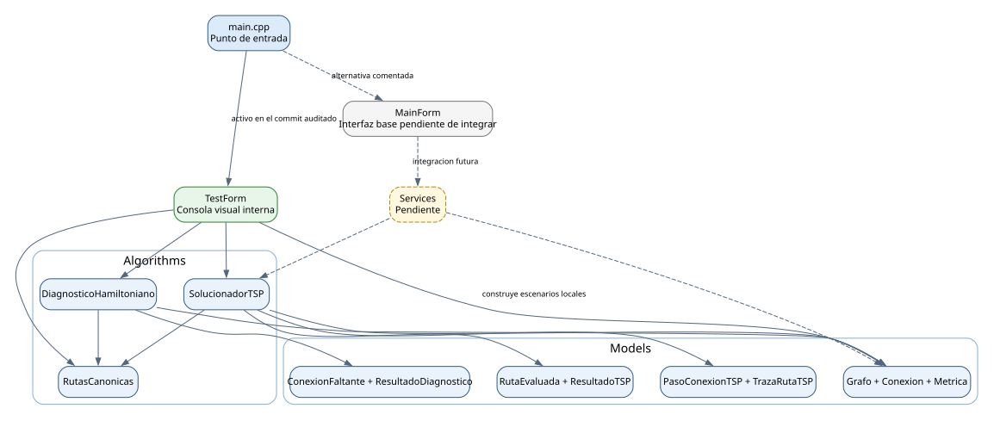
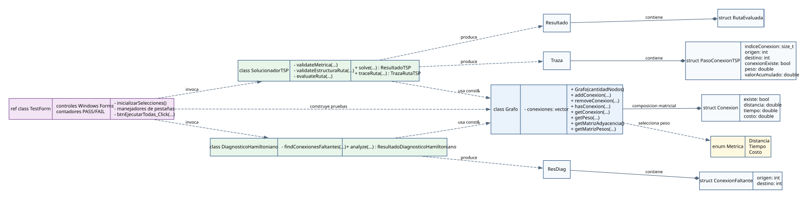
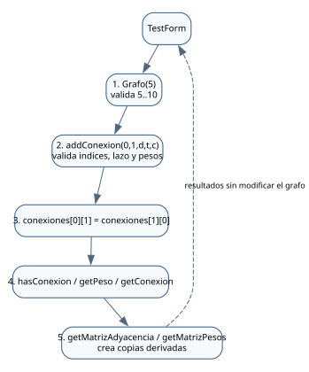
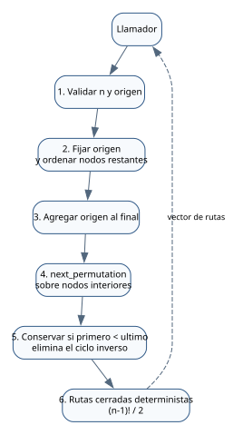
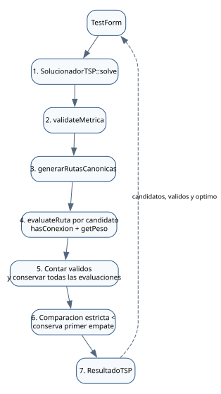
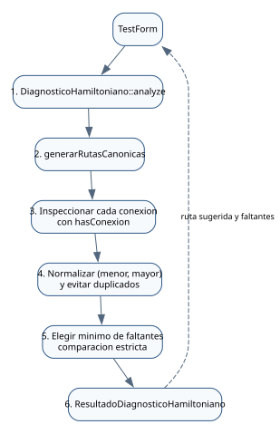
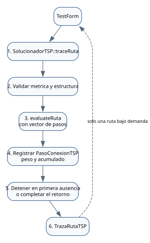
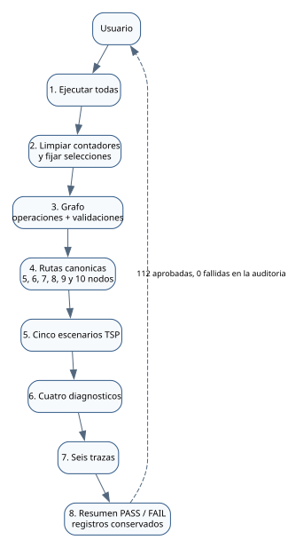

# MathOs-Sky

## Arquitectura actual del núcleo matemático

**Proyecto de Matemática Computacional**  
**Estado auditado:** commit `f40cf0ab4fff9af42328d7255bbc292a1b2f0f33`  
**Fecha de generación:** 26 de septiembre de 2026

---

## Índice

1. Alcance actual
2. Hallazgos de la auditoría
3. Inventario completo de archivos
4. Programación orientada a objetos
5. Arquitectura y dependencias
6. Diagramas de secuencia
7. Flujo funcional actual
8. Fundamento matemático y algorítmico
9. Contratos y excepciones
10. Formulario visual de pruebas
11. Estado del proyecto
12. Guía breve para sustentación
13. Glosario

## 1. Alcance actual

MathOs-Sky es una aplicación académica en C++/CLI que estudia el Problema del Agente Viajero mediante fuerza bruta sobre un grafo no dirigido y ponderado de 5 a 10 nodos. Cada conexión almacena simultáneamente distancia, tiempo y costo.

El núcleo matemático actual está implementado y separado de Windows Forms. Incluye:

- Representación de un grafo no dirigido mediante una matriz cuadrada de objetos `Conexion`.
- Validación de nodos, lazos, pesos positivos, valores finitos y métricas.
- Generación determinista de ciclos hamiltonianos canónicos.
- Eliminación de ciclos equivalentes por rotación e inversión.
- Evaluación exhaustiva del TSP para distancia, tiempo o costo.
- Selección determinista del mejor ciclo.
- Diagnóstico de conexiones faltantes cuando no existe un ciclo hamiltoniano.
- Trazas detalladas generadas bajo demanda para una sola ruta.

`TestForm` es una consola visual interna de verificación. No es la interfaz final y no contiene una segunda implementación del algoritmo. Construye grafos de prueba locales y llama directamente a `Grafo`, `generarRutasCanonicas`, `SolucionadorTSP` y `DiagnosticoHamiltoniano`.

Todavía no están implementados Services, el dominio definitivo de departamentos, la generación manual o aleatoria desde la interfaz, el dibujo del grafo, la reproducción visual ni la integración final con `MainForm`.

### 1.1 Origen de los pesos de TestForm

Los valores usados por `TestForm` **no son aleatorios** y no se cargan desde archivos externos. Se definen de manera determinista en funciones auxiliares locales de `TestForm.cpp`:

- `crearGrafoCompleto`: recorre cada par `origen < destino` y calcula pesos reproducibles.
- Distancia normal: `10 + origen + destino`.
- Tiempo normal: `20 + (destino - origen)`.
- Costo normal: `30 + (origen * 3) + destino`.
- Escenario de empate: los tres pesos valen `1`.
- Escenario de métricas diferentes: ciertas aristas reciben `1`, las demás `9`, y el costo vale `5`.
- Escenario de desbordamiento: cada peso usa aproximadamente la mitad del máximo de `double`.
- `crearGrafoCiclo`: agrega únicamente las aristas del ciclo `0-1-2-3-4-0` con pesos `2+i`, `3+i` y `4+i`.

Cada grafo es una variable local creada al presionar un botón. No existe persistencia entre pruebas.

### 1.2 Situación de los departamentos

El repositorio oficial no contiene todavía un catálogo ni una clase `Departamento`. Los nodos actuales se identifican con enteros. El catálogo de 24 departamentos mencionado durante la auditoría pertenece exclusivamente al prototipo ZIP y se encontraba en `MyForm.Integration.cpp`; no fue copiado al repositorio oficial. La decisión sobre incluir 24 departamentos o 25 regiones de primer nivel contando Callao permanece pendiente para la futura capa Services.

## 2. Hallazgos de la auditoría

### 2.1 Defectos confirmados y corregidos

- Los seis `ComboBox` relevantes iniciaban con `SelectedIndex == -1`. Se añadió una inicialización posterior a `InitializeComponent` que selecciona el índice `0`.
- `Ejecutar todas` dependía parcialmente del estado previo de la interfaz. Ahora fija explícitamente métricas y escenarios iniciales.
- Los manejadores borraban sus resultados antes de cada escenario, por lo que la batería completa solo dejaba visible el último. Durante la ejecución global ahora se conservan todos los registros y se agregan encabezados por escenario.
- La batería global solo comprobaba cinco nodos en rutas canónicas. Ahora ejecuta de 5 a 10 nodos.
- README afirmaba que `MainForm` era el formulario activo, pero el commit auditado ejecuta `TestForm`. README fue alineado con el comportamiento real.
- El proyecto incluía `AGENTS.md`, aunque el archivo está ignorado y no está versionado. Se eliminó únicamente esa referencia no reproducible del `.vcxproj`.

### 2.2 Observaciones descartadas

- No se encontraron defectos funcionales en Models o Algorithms.
- Las declaraciones coinciden con las definiciones y todas usan `namespace MathOsSky`.
- Los algoritmos reciben `const Grafo&` y no modifican el grafo.
- El regreso al origen sí se evalúa porque las rutas terminan en el origen y la evaluación recorre todos los pares consecutivos.
- El desempate es determinista: solo se reemplaza el mejor resultado ante un valor estrictamente menor.
- El desbordamiento de `double` se comprueba antes y después de la suma.
- Las conexiones faltantes se normalizan y no se duplican dentro de una recomendación.
- La traza se detiene en la primera conexión inexistente y conserva el acumulado previo en el paso fallido.
- Los resultados de TestForm provienen de las APIs reales; únicamente los datos de entrada y los valores esperados de las pruebas son deterministas.

## 3. Inventario completo de archivos

| Ruta | Tipo | Responsabilidad | Elementos principales | Depende de | Utilizado por |
|---|---|---|---|---|---|
| `Models/TiposGrafo.h` | Modelo | Contratos fundamentales | `Metrica`, `Conexion` | Biblioteca estándar | `Grafo`, algoritmos, TestForm |
| `Models/Grafo.h` | Modelo | API del grafo ponderado | `Grafo`, alias de matrices | `TiposGrafo` | Algorithms, TestForm |
| `Models/Grafo.cpp` | Modelo | Validaciones y matriz de conexiones | Métodos de `Grafo` | `Grafo.h`, `<cmath>` | Proyecto C++/CLI |
| `Models/TiposTSP.h` | Modelo | Resultados del solucionador | `RutaEvaluada`, `ResultadoTSP` | `<vector>`, `<limits>` | `SolucionadorTSP`, TestForm |
| `Models/TiposPasosTSP.h` | Modelo | Traza de una ruta | `PasoConexionTSP`, `TrazaRutaTSP` | `<vector>` | `SolucionadorTSP`, TestForm |
| `Models/TiposDiagnostico.h` | Modelo | Recomendaciones de aristas | `ConexionFaltante`, `ResultadoDiagnosticoHamiltoniano` | `<vector>` | Diagnóstico, TestForm |
| `Algorithms/RutasCanonicas.h` | Algoritmo | Contrato del generador | `generarRutasCanonicas` | `<vector>` | Solucionador, diagnóstico, TestForm |
| `Algorithms/RutasCanonicas.cpp` | Algoritmo | Permutaciones canónicas | Origen fijo, cierre, inversión | `Grafo`, `<algorithm>` | Proyecto C++/CLI |
| `Algorithms/SolucionadorTSP.h` | Algoritmo | API del TSP y trazas | `SolucionadorTSP` | Todos los tipos TSP y Grafo | TestForm |
| `Algorithms/SolucionadorTSP.cpp` | Algoritmo | Evaluación exhaustiva compartida | `solve`, `traceRuta`, validaciones | Rutas canónicas, Grafo | Proyecto C++/CLI |
| `Algorithms/DiagnosticoHamiltoniano.h` | Algoritmo | API de diagnóstico | `DiagnosticoHamiltoniano` | Grafo, tipos de diagnóstico | TestForm |
| `Algorithms/DiagnosticoHamiltoniano.cpp` | Algoritmo | Minimiza aristas faltantes | `analyze`, normalización | Rutas canónicas, Grafo | Proyecto C++/CLI |
| `tests/TestForm.h` | Formulario interno | Estructura visual y eventos | `TestForm`, controles y manejadores | Windows Forms | `main.cpp` |
| `tests/TestForm.cpp` | Verificación visual | Escenarios y comprobaciones | Helpers deterministas, cinco pestañas | Models y Algorithms | `TestForm.h` |
| `tests/TestForm.resx` | Recurso | Metadata estándar del formulario | Recursos de Windows Forms | Visual Studio Designer | `TestForm.h` |
| `Forms/MainForm.h` | Formulario | Interfaz base todavía vacía | `MainForm` | Windows Forms | Alternativa en `main.cpp` |
| `Forms/MainForm.cpp` | Formulario | Unidad de implementación | Inclusión de `MainForm.h` | `MainForm.h` | Proyecto C++/CLI |
| `Forms/MainForm.resx` | Recurso | Recursos de MainForm | XML de recursos | Visual Studio Designer | `MainForm.h` |
| `main.cpp` | Entrada | Selecciona el formulario activo | `main` STA | `MainForm`, `TestForm` | Ejecutable |
| `MathOs-Sky.vcxproj` | Configuración | Compilación y metadata C++/CLI | Toolset, fuentes, recursos | Visual Studio | Solución |
| `MathOs-Sky.vcxproj.filters` | Configuración | Filtros lógicos de Visual Studio | Models, Algorithms, Forms, Tests | `.vcxproj` | Solution Explorer |
| `README.md` | Documentación | Estado y uso general | Descripción, estructura, ejecución | Repositorio | Equipo |

## 4. Programación orientada a objetos

### 4.1 Clases

`Grafo` encapsula la matriz de conexiones. La matriz es privada; ninguna función externa puede modificarla directamente. Sus operaciones públicas validan las entradas y mantienen la simetría.

`SolucionadorTSP` y `DiagnosticoHamiltoniano` son clases sin estado. Sus métodos son estáticos porque representan operaciones algorítmicas que no necesitan conservar atributos entre llamadas.

`TestForm` es una `ref class` administrada que hereda de `System::Windows::Forms::Form`. Esta es la única herencia relevante. No existe herencia entre las clases del núcleo.

### 4.2 Estructuras

Las estructuras son contratos de datos simples:

- `Conexion` almacena existencia y tres pesos.
- `RutaEvaluada` almacena secuencia, validez y total.
- `ResultadoTSP` agrupa todas las evaluaciones y el óptimo.
- `PasoConexionTSP` representa una conexión inspeccionada.
- `TrazaRutaTSP` agrupa los pasos de una ruta seleccionada.
- `ConexionFaltante` representa una arista no dirigida normalizada.
- `ResultadoDiagnosticoHamiltoniano` agrupa la recomendación.

### 4.3 Constancia y referencias

Los algoritmos reciben `const Grafo&`. Esto evita copiar toda la matriz y garantiza que no pueden modificar el grafo. Los métodos de consulta de `Grafo` son `const`. Dentro del solucionador se usan referencias constantes a rutas y evaluaciones para evitar copias innecesarias.

### 4.4 Relaciones

- **Composición:** `Grafo` contiene una matriz de `Conexion`.
- **Agregación de resultados:** `ResultadoTSP` contiene `RutaEvaluada`; `TrazaRutaTSP` contiene pasos; el diagnóstico contiene conexiones faltantes.
- **Dependencia:** Algorithms usa Models mediante parámetros y valores de retorno.
- **Uso:** TestForm construye modelos locales e invoca Algorithms.
- **Herencia:** solo `TestForm` y `MainForm` heredan de Windows Forms.

## 5. Arquitectura y dependencias

La dirección real del código implementado es `TestForm -> Algorithms -> Models`. `TestForm` también usa `Grafo` directamente para preparar datos de prueba. Services se muestra como pendiente y no participa todavía en la ejecución.

### 5.1 UML de clases y estructuras

## 6. Diagramas de secuencia

### 6.1 Construcción y consulta de un Grafo

### 6.2 Generación de rutas canónicas

### 6.3 SolucionadorTSP::solve

### 6.4 DiagnosticoHamiltoniano::analyze

### 6.5 SolucionadorTSP::traceRuta

### 6.6 Botón Ejecutar todas

## 7. Flujo funcional actual

En el commit auditado, `main.cpp` ejecuta `TestForm`. El flujo real es:

1. `main.cpp` configura Windows Forms y abre `TestForm`.
2. El constructor llama a `InitializeComponent` y selecciona el índice cero de cada `ComboBox`.
3. El usuario elige una pestaña o presiona `Ejecutar todas`.
4. `TestForm.cpp` crea un `Grafo` local con datos deterministas.
5. La pestaña llama a la API real correspondiente.
6. Models conserva el estado del grafo; Algorithms produce resultados por valor.
7. TestForm convierte vectores y matrices a texto o filas de `DataGridView`.
8. Las verificaciones comparan el resultado real con una expectativa conocida y registran PASS o FAIL.

El formulario no conserva un `Grafo` como atributo. Cada evento crea sus objetos nativos localmente y los destruye al terminar.

## 8. Fundamento matemático y algorítmico

### 8.1 Grafo y matriz interna

El grafo se modela como `G = (V, E)`. La matriz privada `conexiones[u][v]` almacena un objeto `Conexion`. Al agregar una arista se asigna el mismo objeto en `[u][v]` y `[v][u]`, por lo que:

`w(u,v) = w(v,u)`

La diagonal permanece sin conexiones. Los métodos de matrices crean copias derivadas:

- La matriz de adyacencia usa `1` si existe una conexión y `0` en caso contrario.
- La matriz de pesos selecciona distancia, tiempo o costo; las ausencias y la diagonal permanecen en cero.
- Obtener una matriz no modifica el grafo.

### 8.2 Ciclo hamiltoniano

Una ruta hamiltoniana visita cada nodo exactamente una vez. Un ciclo hamiltoniano además regresa al origen. Para cinco nodos, una secuencia cerrada contiene seis posiciones: cinco visitas y el origen repetido al final.

### 8.3 Rutas canónicas

El origen se fija para eliminar equivalencias por rotación. Los nodos restantes se permutan lexicográficamente y el origen se agrega al final. Como el grafo es no dirigido, un ciclo y su inverso son equivalentes. La condición que conserva una sola orientación reduce el total a:

`(n - 1)! / 2`

| Nodos | Ciclos canónicos |
|---:|---:|
| 5 | 12 |
| 6 | 60 |
| 7 | 360 |
| 8 | 2 520 |
| 9 | 20 160 |
| 10 | 181 440 |

### 8.4 Fuerza bruta del TSP

El solucionador evalúa todos los ciclos canónicos. Para cada par consecutivo consulta `hasConexion`; si falta una arista, la ruta queda inválida con total cero. Si existe, obtiene el peso seleccionado mediante `getPeso` y lo acumula. Solo los ciclos válidos compiten por el mínimo.

La comparación usa `<` y no `<=`, por lo que un empate conserva la primera ruta canónica. La suma comprueba desbordamiento antes de agregar cada peso y verifica que el acumulado continúe siendo finito.

### 8.5 Diagnóstico hamiltoniano

Para cada ruta se obtiene el conjunto de aristas inexistentes. Cada arista se normaliza como `(menor, mayor)` y se evita repetirla. Se elige la primera ruta que necesita la menor cantidad de conexiones nuevas. El algoritmo no usa pesos ni modifica el grafo.

### 8.6 Evaluación paso a paso

`traceRuta` valida primero la estructura hamiltoniana. Después reutiliza la misma función de evaluación que `solve`, pero proporciona un vector donde se materializan los pasos. Solo se guarda la traza de la ruta solicitada, evitando almacenar millones de pasos para los 181 440 candidatos de diez nodos.

### 8.7 Complejidad

La cantidad de rutas crece factorialmente. La generación requiere `O((n-1)!)` y la evaluación completa agrega un factor lineal por las `n` aristas de cada ciclo. El límite de diez nodos mantiene el ejercicio exhaustivo dentro de una escala académica razonable; aumentarlo produciría un crecimiento muy rápido de tiempo y memoria.

## 9. Contratos y excepciones

| Método | Entrada | Salida | Precondiciones | Excepciones | Modifica el grafo |
|---|---|---|---|---|---|
| `Grafo(cantidadNodos)` | Entero | Objeto Grafo | 5 a 10 | `invalid_argument` | Construye estado nuevo |
| `addConexion` | Dos nodos y tres pesos | `void` | Índices válidos, sin lazo, pesos positivos finitos | `out_of_range`, `invalid_argument` | Sí, simétricamente |
| `removeConexion` | Dos nodos | `void` | Índices válidos | `out_of_range` | Sí, simétricamente |
| `hasConexion` | Dos nodos | `bool` | Índices válidos | `out_of_range` | No |
| `getConexion` | Dos nodos | `Conexion` | Índices válidos | `out_of_range` | No |
| `getPeso` | Dos nodos y métrica | `double` | Conexión existente y métrica válida | `out_of_range`, `logic_error`, `invalid_argument` | No |
| `getMatrizAdyacencia` | Ninguna | Matriz de enteros | Grafo construido | Ninguna esperada | No |
| `getMatrizPesos` | Métrica | Matriz de `double` | Métrica válida | `invalid_argument` | No |
| `generarRutasCanonicas` | Cantidad y origen | Vector de rutas | 5 a 10 y origen válido | `invalid_argument` | No recibe grafo |
| `SolucionadorTSP::solve` | Grafo, origen, métrica | `ResultadoTSP` | Origen y métrica válidos | `invalid_argument`, `overflow_error` | No |
| `SolucionadorTSP::traceRuta` | Grafo, ruta, métrica | `TrazaRutaTSP` | Ruta hamiltoniana estructural y métrica válida | `invalid_argument`, `overflow_error` | No |
| `DiagnosticoHamiltoniano::analyze` | Grafo y origen | Resultado de diagnóstico | Origen válido | `invalid_argument` desde rutas canónicas | No |

## 10. Formulario visual de pruebas

### 10.1 Grafo

Usa directamente `Grafo`. Comprueba construcción, reemplazo de pesos, simetría, eliminación idempotente, consultas, matrices y rechazo de entradas inválidas. La matriz de pesos mostrada corresponde al selector de métrica.

### 10.2 Rutas canónicas

Usa `generarRutasCanonicas`. Permite elegir de 5 a 10 nodos y un origen. Verifica conteo, cierre, longitud, orientación única y determinismo. Solo muestra las primeras 100 rutas.

### 10.3 Solucionador TSP

Usa `SolucionadorTSP::solve`. Incluye grafos completo, parcial, vacío, empate y pesos diferenciados por métrica. Muestra candidatos, ciclos válidos, mejor ruta, mejor valor y hasta 100 evaluaciones. También prueba métrica inválida y desbordamiento.

### 10.4 Diagnóstico

Usa `DiagnosticoHamiltoniano::analyze`. Comprueba grafo completo, vacío, una conexión faltante y empate. Verifica normalización, ausencia de duplicados e inmutabilidad mediante comparación de nodos y matrices antes y después.

### 10.5 Traza

Usa `SolucionadorTSP::traceRuta`. Prueba ruta completa, ausencia al inicio, en medio y al regresar, estructura incorrecta y desbordamiento. La tabla muestra índice, origen, destino, existencia, peso y acumulado.

### 10.6 Ejecutar todas

Fija selecciones conocidas, ejecuta las operaciones del grafo, las rutas de 5 a 10 nodos, los cinco escenarios TSP, los cuatro diagnósticos y las seis trazas. Durante la auditoría produjo **112 pruebas aprobadas y 0 fallidas**. Los registros se conservan por escenario en lugar de reemplazarse.

## 11. Estado del proyecto

### Terminados

- Modelo del grafo ponderado no dirigido.
- Matrices derivadas.
- Rutas canónicas.
- Solucionador TSP por fuerza bruta.
- Diagnóstico hamiltoniano.
- Trazas bajo demanda.

### En validación

- `TestForm` como consola interna.
- Compatibilidad práctica con View Designer, pendiente de apertura manual en el entorno de Visual Studio.
- Rendimiento y experiencia visual con diez nodos.

### Pendientes

- Modelo y catálogo definitivo de departamentos.
- Services.
- Creación manual y generación aleatoria.
- Integración con `MainForm`.
- Dibujo del grafo.
- Ejecución asíncrona y controles de reproducción.
- Pruebas automatizadas permanentes.

### Próximo módulo recomendado

La siguiente etapa debería ser Services: catálogo de departamentos, construcción manual y aleatoria del grafo, conversión de entradas y coordinación del núcleo. Esta capa debe mantener Models y Algorithms independientes de Windows Forms.

## 12. Guía breve para sustentación

### 12.1 Orden sugerido

1. Presentar el problema práctico y el grafo ponderado.
2. Explicar `Conexion`, `Metrica` y la matriz interna de `Grafo`.
3. Mostrar cómo se fija el origen y se eliminan ciclos inversos.
4. Explicar la evaluación exhaustiva y el desempate.
5. Mostrar el diagnóstico cuando no hay ciclo.
6. Mostrar una traza bajo demanda.
7. Ejecutar `TestForm` y aclarar que no es la interfaz final.
8. Cerrar con complejidad factorial y trabajo pendiente.

### 12.2 Preguntas posibles

**¿Cuál es la diferencia entre ruta y ciclo hamiltoniano?**  
La ruta visita cada vértice una vez; el ciclo además regresa al origen.

**¿Qué agrega el TSP?**  
Entre los ciclos hamiltonianos válidos, busca el de menor peso total según una métrica.

**¿Por qué se fija el origen?**  
Para no contar rotaciones del mismo ciclo como soluciones diferentes.

**¿Por qué se elimina la ruta inversa?**  
Porque en un grafo no dirigido recorre exactamente las mismas aristas.

**¿Por qué no se usa una biblioteca de optimización?**  
La fuerza bruta y su análisis son parte de la contribución evaluada del curso.

**¿Por qué la traza es bajo demanda?**  
Para no guardar los pasos de 181 440 rutas cuando solo se necesita visualizar una.

**¿Por qué se limita a diez nodos?**  
Porque la cantidad de candidatos crece factorialmente.

**¿Los datos de TestForm son reales o aleatorios?**  
Son datos deterministas de prueba creados en memoria; no representan todavía departamentos reales.

**¿Los algoritmos modifican el grafo?**  
No. Reciben referencias constantes y solo consultan su API pública.

## 13. Glosario

| Término | Definición |
|---|---|
| Arista | Conexión entre dos nodos |
| Ciclo hamiltoniano | Ciclo que visita cada nodo una vez y regresa al origen |
| Conexión faltante | Arista necesaria para completar una ruta candidata |
| Fuerza bruta | Evaluación exhaustiva de todos los candidatos posibles |
| Grafo no dirigido | Grafo donde una conexión funciona en ambos sentidos |
| Matriz de adyacencia | Representación con 1 y 0 de las conexiones existentes |
| Matriz de pesos | Representación derivada de distancia, tiempo o costo |
| Métrica | Criterio numérico usado para evaluar una ruta |
| Nodo | Vértice del grafo; actualmente se representa mediante un entero |
| Permutación | Ordenamiento posible de los nodos interiores |
| Ruta canónica | Representante único de un ciclo tras eliminar rotaciones e inversión |
| Trazabilidad | Capacidad de observar cada conexión evaluada y su acumulado |
| TSP | Problema del Agente Viajero: encontrar el ciclo hamiltoniano de menor peso |

---

**Conclusión:** el núcleo actual es matemáticamente coherente para el alcance de 5 a 10 nodos. La arquitectura mantiene Models y Algorithms separados de Windows Forms. Las siguientes decisiones corresponden al dominio de departamentos, Services y la integración final, no a una reescritura del núcleo.
